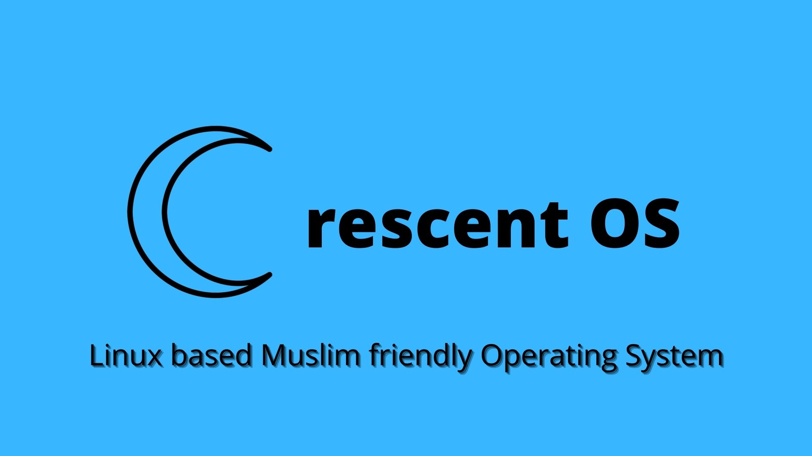

    <b>
        Bismillahir Rahmanir Rahim.
    </b>

 

    <h1>
        OS Development Plan
    </h1>

 
  

Assalamu Alaikum Wa Rahmatullah :wave: . 
Welcome to the project of Crescent OS :kissing_heart: .

# About

**Crescent OS** ( or **Crescent Operating System** ) is a Muslim friendly operating system based on **Linux kernel**.   

# Index

- [Organisational ReadMe](https://github.com/CrescentOS-repo/.github)

- [Project Roadmap](https://github.com/CrescentOS-repo/roadmap)

- [Discussion Board](https://github.com/CrescentOS-repo/discussion-board)

<!-- - [Package Repo](#) -->

<!-- - [Wiki](#) -->

# Online Accounts

  
  
  
  
  
  
  
  

<!-- To make another badges go to: https://shields.io/ >
